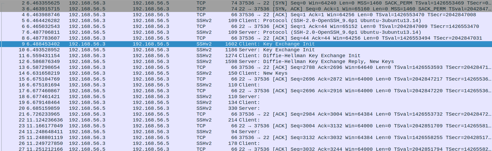
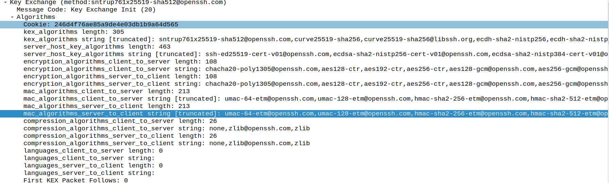
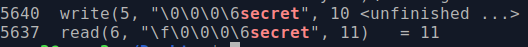
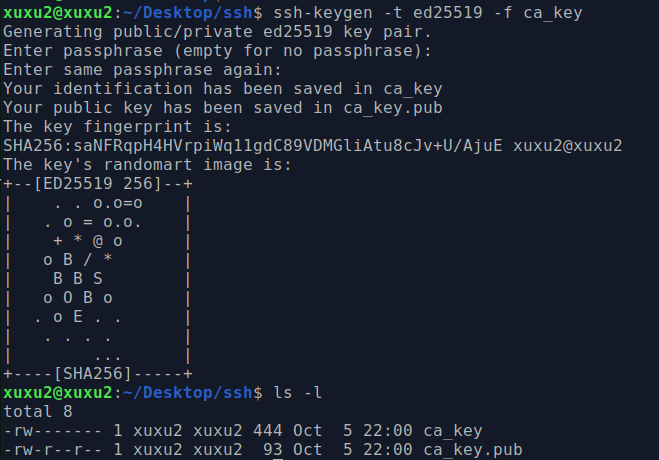
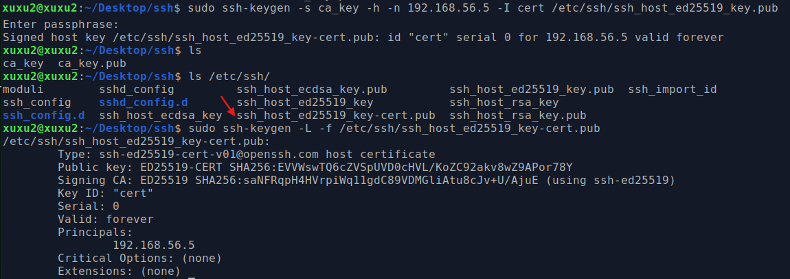
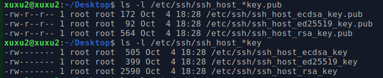

## 1. Montage du Réseau

### 1.1 Architecture des Machines Virtuelles

Deux machines virtuelles ont été créées sous VirtualBox avec les caractéristiques suivantes :

**Machine Virtuelle 1 (Xubuntu1) : Client**
- Système d'exploitation : Xubuntu 24.04.3 LTS
- Mémoire vive : 4 Go RAM
- Processeurs : 2 CPU
- Disque dur : 20 Go
- Interfaces réseau :
  - NAT : accès Internet
  - Host-Only : communication inter-VM

**Machine Virtuelle 2 (Xubuntu2) : Serveur**
- Système d'exploitation : Xubuntu 24.04.3 LTS
- Mémoire vive : 4 Go RAM
- Processeurs : 2 CPU
- Disque dur : 20 Go
- Interfaces réseau :
  - NAT : accès Internet
  - Host-Only : communication inter-VM

### 1.2 Installation et Configuration

**Étapes d'installation**
1. Installation de Xubuntu 24.04.3 sur les deux machines virtuelles
2. Mise à jour complète du système sur chaque machine :
   ```bash
   sudo apt update && sudo apt upgrade -y
   ```
3. Installation d'OpenSSH :
   ```bash
   sudo apt install openssh-server openssh-client
   ```

**Version d'OpenSSH installée**
- OpenSSH_9.7p1 Ubuntu-3ubuntu13.14
- OpenSSL 3.0.13

**Configuration du service SSH**
1. Activation du service SSH :
   ```bash
   sudo systemctl start ssh
   sudo systemctl enable ssh
   ```
2. Vérification du statut :
   ```bash
   sudo systemctl status ssh
   ```
3. Configuration du pare-feu :
   ```bash
   sudo ufw allow ssh
   sudo ufw enable
   ```

### 1.3 Configuration des Comptes Utilisateurs

Un compte utilisateur standard a été créé sur chaque machine :
```bash
sudo adduser ziane
```

### 1.4 Configuration Réseau

Les adresses IP configurées sur l'interface Host-Only :
- **Xubuntu1** : 192.168.56.3
- **Xubuntu2** : 192.168.56.5

Test de connectivité entre les deux machines :
```bash
xubuntu2:$ ping -c3 192.168.56.3
xubuntu1:$ ping -c3 192.168.56.5
```

## 2. Telnet
   ### 2.1 Installation et Configuration du service
   On installe le service telnet sur les deux machines, et l'active sur la machine serveur (xubuntu 2).
   **Vérification que le service écoute sur le port 23 :**
   ```bash
   sudo netstat -ltn | grep 23
   ```
   **Résultat :**
   ```
   tcp6    0    0 :::23    :::*    LISTEN
   ```

   ### 2.2 Capture des trames avec tcpdump
   Sur la machine cliente (Xubuntu1) on lance la capture sur un terminal qui filtre le trafic telnet (port 23) et le sauvegarde dans un fichier pcap.
   
   ```bash
   sudo tcpdump -i enp0s8 -A port 23 -w telnet.pcap
   ```

   ### 2.3 Connexion Telnet
   Dans un deuxième terminal on se connecte au serveur.
   ```bash
   telnet 192.168.56.5
   ```
   On s'authentifie avec les identifiants (login: ceryne, Password: secret)
   Durant la session, on execute quelque commande telles que pwd, whoami, ls et on quitte la session avec exit. On arrête la apture dans le terminal 2.

   ### 2.3 Vérification du fichier pcap
   Lecture du fichier avec tcpdump ou wireshark pour l'analyse des trames. 
   ```bash
   tcpdump -A -r telnet.pcap
   tshark -r telnet.pcap -q -z "follow,tcp,ascii,0"
   ``` 
   **Observations:**  
   1. La transmission caractère par caractère des données entrées par le client au serveur.
   2. Les caractères du login (`c`, `e`, `r`, `y`, `n`, `e`) et du mot de passe ( `s`, `e`, `c`, `r`, `e`, `t`) apparaissent en clair dans les paquets successifs. Il suffit de les concaténer pour reconstituer le login et le mot de passe complets.
   3. Toutes les commandes exécutées et leurs résultats sont visibles en clair.

   ### 2.4 Désactivation du serveur Telnet
   ```bash
   sudo systemctl stop xinetd
   sudo systemctl disable xinetd
   sudo apt remove --purge telnetd xinetd
   sudo apt autoremove
   ```
## 3. SSH
   ### 3.1 Analyse des fichiers de configurations
   ```bash
   ls -la /etc/ssh/
   ```
   Le répertoire **/etc/ssh/** contient des fichiers de configuration ainsi des clés publiques et privées de l'hôte:
   - **sshd_config**: Contient la configuration du serveur SSH
   - **ssh_config**: Contient la configuration du client SSH.
   La version 2 du protocole SSH est utilisée par défaut.

   **NB**: Le fichier ~/.ssh/config propose une configuration personnelle du client SSH par l'utilisateur.

   ### 3.2 Identification des clés du serveur
   Le serveur utilise RSA, ECDSA et ED25519.
   ```bash
   ls -l /etc/ssh/ssh_host_*
   ```

   ### 3.3 Empreintes des clés
   Les empreintes sont des hash ou signatures unique du serveur, cela permet au client de vérifier l'identité du serveur lors de la première connexion.
   ```bash
   for key in /etc/ssh/ssh_host_*key.pub; do
      sudo ssh-keygen -lf "$key"
   done
   ```

   ### 3.4 Permissions sur les clés privées
   Les permissions actuelles sont en lecture/écriture uniquement pour le propriétaire (root), et aucun accés pour le groupe ou autres utilisateurs (**600**).

   #### 3.4.1 PermitRootLogin
   Modifier la ligne "PermitRootLogin prohibit-password" à no, va interdire complétement la connextion SSH en tant que root.

   #### 3.4.1 PrintLastLogin
   Pour afficher la date et l'heure de la dernière connexion (lors du login), cela permet de détecter des connexions non autorisées. Le paramètre est active par défaut.
   ```bash
   sudo systemctl restart ssh
   ```

## 4. Authentification Client par mot de passe
   ### 4.1 Capture de trames SSH
   On lance la capture sur  la machine cliente (Xubuntu1) et la connexion SSH sur deux terminaux distincts.
   ```bash
   sudo tcpdump -i enp0s8 -w ssh.pcap port 22
   ssh ceryne@192.168.56.5
   ```
   **Résultat**
   ```
   The authenticity of host '192.168.56.5 (192.168.56.5)' can't be established.
   ED25519 key fingerprint is SHA256:EVVWswTQ6c...
   This key is not known by any other names.
   Are you sure you want to continue connecting (yes/no/[fingerprint])?
   ```
   Ce message apparaît lors de la première authentification à un serveur SSH inconnu car la clé publique du serveur n'est pas dans le fichier `~/.ssh/known_hosts`.

   On remarque que c'est le même fingerprint de la clé publique du serveur qui est dans le fichier `/etc/ssh/ssh_host_ed25519_key.pub`, donc on peut taper **yes**.

   ### 4.2 Analyse des paquets et du protocole SSH-TRANS
   On visualize le contenu de la capture sous wireshark:
   - Établissement de la version SSH (SSH-2).
   - Échange des listes d'algorithmes supportés entre client et serveur pour la négociation.
   - Échange Deffie-hellman et génération des clés de session symétriques pour le chiffrement.
   - Authentification du serveur et le client vérifie la signature avec la clé publique du serveur.
   - Authentification du client
   - Établissement du canal et la transmission des données est chiffrée et authentifiée.
   
   ### 4.3 Algorithmes symétriques
   ```bash
   ssh -Q cipher
   ```
   Les algorithmes supportés par le serveur sont: 3des-cbc, aes128-cbc,aes192-cbc, aes256-cbc, aes128-ctr, aes192-ctr, aes256-ctr, aes128-gcm, aes256-gcm,chacha20-poly1305.

   ### 4.4 Algorithmes MAC
      #### 4.4.1 Visualiser sur wireshark
      Les algorithmes garantissant l'intégrité et l'authenticité des messages suportés sont:
      hmac-sha1, hmac-sha1-96, hmac-sha2-256, hmac-sha2-512, hmac-md5, hmac-md5-96, umac-64@openssh.com, umac-128@openssh.com, hmac-sha1-etm@openssh.com, hmac-sha2-256-etm@openssh.com, hmac-sha2-512-etm@openssh.com, umac-64-etm@openssh.com, umac-128-etm@openssh.com, hmac-sha2-256-etm@openssh.com, hmac-sha2-512-etm@openssh.com, hmac-sha1-etm@openssh.com.
      

      #### 4.4.2 Configurer les MAC
      On peut ajouter les algorithmes dans le fichier '/etc/ssh/sshd_config'.
   
   ### 4.5 Récupération du Mot de Passe
   D'abord on récupère le PID du processus sshd sur le serveur (Xubuntu2):
   ```bash
   ps aux | grep sshd
   ```
   Ensuite on attache strace au processus sshd (PID=1093):
   ```bash
   sudo strace-f -p 1093 -s 2038 -o sshd.txt
   ```
   On lance la session SSH depuis le client, puis on arrête strace.
   **Recherche du mot de pass dans le fichier trace**
   Avec un grep on retrouve le mot de passe du client en clair.
   

## 5. Autorité SSH
   ### 5.2 Génération de la clé de CA
   
   ### 5.3 Génération du certificat signé
   
   

   ### 5.4 Configuration du client
   On ajoute la clé publique de l'autorité avec la directive @cert-authority:
   ```bash
   echo "@cert * $(cat ~/ca_key.pub)" > ~/.ssh/known_hosts
   ```

   ### 5.5 Test de connectivité
   On observe que le certificat est validé via l'autorité de confiance:
   ```bash
   ssh -v ceryne@192.168.56.5
   # Résultat: debug1: Host '192.168.56.5' is known and matches the host certificate.
   #debug1: Found CA key in /home/user/.ssh/known_hosts:1
   ```


## 6. Redirection de ports Nginx
   Pour écouter uniquement sur localhost, il suffit de modifier la ligne listen dans le fichier de configuration et redémarrer le serveur: 
   ```bash
   sudo nano /etc/nginx/sites-available/default
   > listen 127.0.0.1:80 default_server;
   sudo systemctl restart nginx
   ```

   Pour que le serveur soit accessible depuis l'extérieure on doit faire une redirection SSH.
   **Création page web personnalisée sur le serveur**
   ```bash
   echo "<h1>Serveur Web Nginx via SSH Tunnel</h1>" | sudo tee /var/www/html/index.html
   ```
   **Création du tunnel SSH depuis le client (Xubuntu1)**
   Cette commande redirige le port local 8080 vers le port 80 de localhost sur le serveur:
   ```bash
   ssh -L 8080:127.0.0.1:80 ceryne@192.168.56.5 -N
   ```
   ### 6.1 Test d'accès au service web via le tunnel
   Sur la machine cliente on test avec curl:
   ```bash
   curl http://localhost:8080
   Résultat: "<h1>Serveur Web Nginx via SSH Tunnel</h1>"
   ```

   ### 6.2 Empêcher la redirection de port (En tant qu'Administrateur)
   Sur le serveur on accède au fichier de onfiguration */etc/ssh/sshd_config* et on modifie les directives comme suit:
   ```bash
   AllowTcpForwarding no
   GatewayPorts no
   PermitTunnel no
   ```
## 7. Authentification Client par clé RSA
   La clé privée est stocké dans un fichier texte avec les permissions 600 (Lecture et écriture uniquement par le propriétaire), chiffré avec *aes-256-ctr* et encodé en *base64*.

   On utilise *ssh-copy-id* pour copier la clé publique, ensuite depuis le serveur on vérifie que la clé est stockée par défaut dans le fichier */.ssh/authorized_keys*

   Si l'authentification RSA échoue, l'authentification par mot de passe prendera place.
   
   La sécurité à apporté par les clés est une connexion sans mot de passe, une forte résistance aux attaques et une gestion simple des accès. 

   La valeur par défaut de StrictModes est à yes, elle permet que:
   - SSH vérifie strictement les permissions des fichiers et répertoires liés à l'authentification
   - Refuse la connexion si les permissions sont trop permissives


